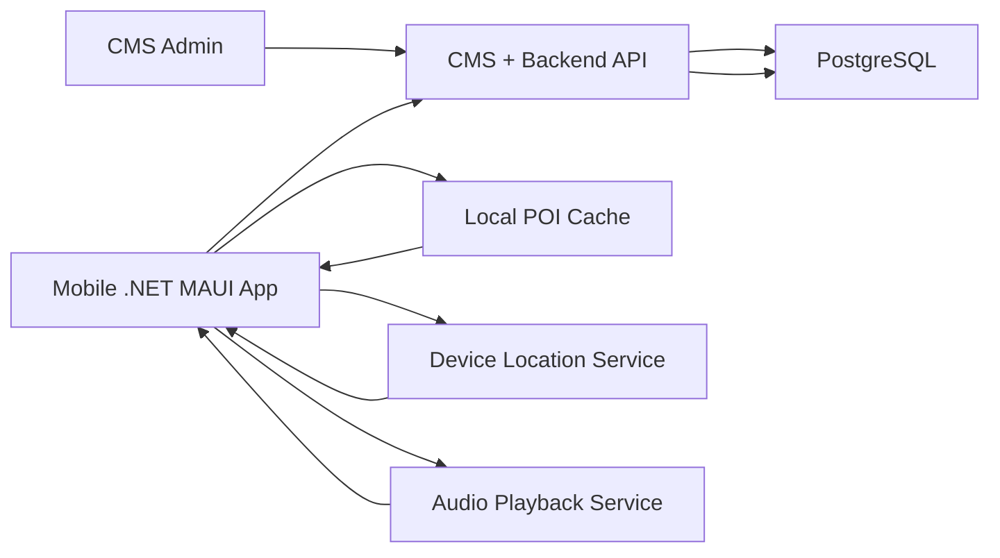

# MVP Architecture

## Objective

Define the minimum integrated architecture for the coursework MVP so all streams implement and demo the same flow.

## Architectural Scope

- Mobile .NET MAUI app consumes POI data from backend API
- CMS manages POI records that follow the shared contract
- Backend persists POIs and playback logs in PostgreSQL
- Analysis stream validates that architecture and artifacts stay aligned with `docs/mvp-parallel-plan.md`

## Component View

## Responsibilities By Component

### Mobile App

- Fetches POIs from `GET /api/pois`
- Stores POIs locally for basic offline fallback
- Determines nearest POI by distance using latitude, longitude, and `triggerRadiusMeters`
- Allows manual narration playback and optionally auto playback when stable
- Sends playback events to `POST /api/logs/playback`

### CMS + Backend API

- Provides CRUD management for POIs in the admin flow
- Exposes POI payloads using the shared JSON field names
- Accepts playback log submissions from the mobile app
- Reads and writes POI and playback log records in PostgreSQL

### PostgreSQL

- Stores canonical POI data used by CMS and API
- Stores playback logs for demo evidence and basic analytics follow-up

## Runtime Flow

1. CMS admin creates or updates a POI.
2. Backend persists the POI with the shared fields.
3. Mobile requests POIs from the API.
4. Mobile caches the response locally.
5. User chooses a POI manually or enters the trigger radius.
6. Mobile plays narration through TTS using `ttsScript`, or falls back to POI name and description when `ttsScript` is empty.
7. Mobile posts a playback log event back to the backend.

## Integration Rules

- API payloads must preserve the exact field names defined in `docs/mvp-parallel-plan.md`.
- `id` is a UUID across storage, API, and mobile cache.
- `updatedAt` remains part of the shared contract even though the current mobile flow refreshes on a timer instead of using it as a sync cursor.
- `isActive = false` means the POI should not be shown or triggered in the mobile experience.
- `audioUrl` is still carried in the shared contract, but the current mobile implementation narrates through TTS rather than audio streaming.

## Non-Goals For This MVP

- Background tracking that depends on production-grade native geofencing
- Advanced synchronization conflict handling
- Analytics dashboards
- Complex access control and multi-role administration
