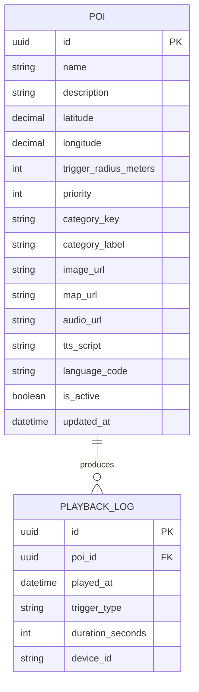

# MVP ERD

## Purpose

This ERD defines the minimum relational model required to support the shared POI contract and playback logging contract.

## Entity Relationship Diagram

## Mapping To Shared API Contract

| API field | Database column |
| --- | --- |
| `id` | `id` |
| `name` | `name` |
| `description` | `description` |
| `latitude` | `latitude` |
| `longitude` | `longitude` |
| `triggerRadiusMeters` | `trigger_radius_meters` |
| `priority` | `priority` |
| `categoryKey` | `category_key` |
| `categoryLabel` | `category_label` |
| `imageUrl` | `image_url` |
| `mapUrl` | `map_url` |
| `audioUrl` | `audio_url` |
| `ttsScript` | `tts_script` |
| `languageCode` | `language_code` |
| `isActive` | `is_active` |
| `updatedAt` | `updated_at` |

## Data Constraints

- `poi.id` must be a UUID.
- `poi.latitude` must be within `-90` to `90`.
- `poi.longitude` must be within `-180` to `180`.
- `poi.trigger_radius_meters` must be greater than `0`.
- `poi.priority` defaults to `1`.
- `poi.language_code` defaults to `vi-VN` for the demo seed unless another language is explicitly needed.
- `playback_log.trigger_type` is restricted to `gps`, `qr`, or `manual`.
- `playback_log.poi_id` must reference an existing POI.

## Notes

- Column names may use snake_case in PostgreSQL, but API payloads must remain camelCase.
- The current CMS implementation stores these entities in `pois` and `playback_logs`.
- The MVP does not require separate tables for categories, tours, or media assets.
