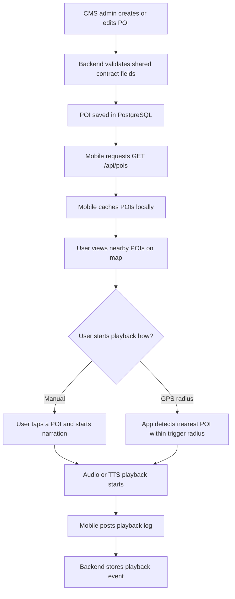

# MVP Workflow

## End-To-End User Workflow

## Workflow Details

### 1. POI Management Workflow

1. Admin creates or edits a POI from CMS.
2. Required shared fields are validated before save.
3. The API persists the POI in PostgreSQL.
4. Updated records are exposed via `GET /api/pois` and `GET /api/pois/{id}`.

### 2. Mobile Consumption Workflow

1. Mobile app calls `GET /api/pois` on startup or refresh.
2. The app stores the returned POIs in local cache.
3. If the network is unavailable, the app uses the latest cached POI set.
4. The map screen displays active POIs only.

### 3. Playback Workflow

1. User selects a POI manually or enters a stable trigger radius.
2. Mobile determines the target POI using distance and `priority` when needed.
3. Narration starts from `audioUrl` or fallback narration content supported by the mobile stream.
4. Mobile submits a playback event with `poiId`, `playedAt`, `triggerType`, `durationSeconds`, and `deviceId`.

## Operational Workflow For Demo Day

1. Seed PostgreSQL with demo POIs that match the shared contract.
2. Verify CMS can list and edit those POIs.
3. Verify mobile can fetch and display them.
4. Run one manual playback and one playback log submission.
5. If stable, run one trigger-radius playback scenario.

## Failure Handling Expectations

- If API is unavailable, mobile uses cached POIs and disables refresh-dependent expectations.
- If GPS accuracy is weak, the demo falls back to manual playback.
- If audio streaming fails, the team demonstrates POI selection and log submission separately.
