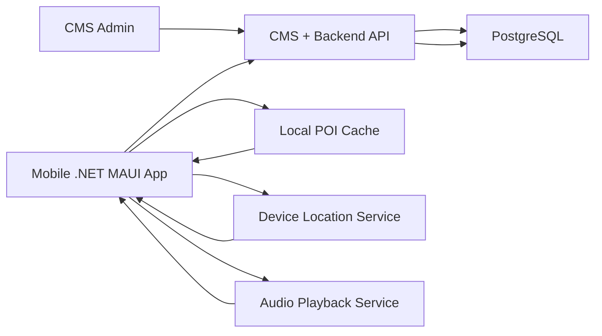
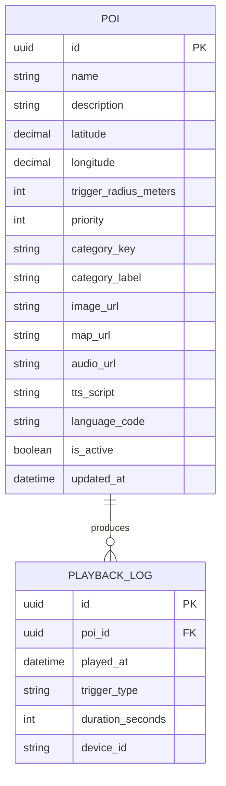

# Tài liệu Đặc tả Yêu cầu Sản phẩm (PRD)

**Tên dự án:** GeoGuide - Ứng dụng Thuyết minh Địa điểm Tự động  
**Người phụ trách (PO/PM):** Võ Minh Sang  
**Phiên bản tài liệu:** 2.0 - MVP Integrated  
**Ngày cập nhật cuối:** 10/04/2026

---

## 1. TỔNG QUAN

### 1.1. Bài toán cần giải quyết

Khách du lịch hoặc người tham quan tại một khu vực thường thiếu thông tin ngắn gọn, đúng lúc và dễ tiếp cận về địa điểm đang đứng gần. Việc phải đọc bảng thông tin, tìm kiếm thủ công hoặc phụ thuộc hoàn toàn vào hướng dẫn viên làm giảm trải nghiệm và khó mở rộng quy mô.

Ở chiều ngược lại, đơn vị vận hành cần một công cụ tập trung để:

- quản lý danh sách địa điểm thuyết minh
- cập nhật nội dung giới thiệu
- kiểm soát trạng thái hoạt động của từng POI
- ghi nhận dữ liệu sử dụng cơ bản để phục vụ demo và mở rộng phân tích sau này

### 1.2. Mục tiêu sản phẩm

- Cung cấp trải nghiệm bản đồ có định vị vị trí người dùng.
- Hiển thị POI gần người dùng trên app mobile.
- Hỗ trợ phát thuyết minh cho POI theo 2 cách:
  - thủ công từ giao diện
  - tự động theo bán kính kích hoạt nếu điều kiện ổn định
- Cung cấp CMS web admin để quản lý dữ liệu POI.
- Đồng bộ dữ liệu POI từ backend sang mobile thông qua API dùng chung.
- Ghi nhận playback log sau mỗi lần thuyết minh hoàn tất.

### 1.3. Mục tiêu của phiên bản hiện tại

Phiên bản hiện tại là **MVP tích hợp** nhằm chứng minh luồng end-to-end:

1. Tạo hoặc chỉnh sửa POI trong CMS.
2. Backend API trả POI theo shared contract.
3. Mobile tải POI, hiển thị trên bản đồ và danh sách.
4. Mobile phát thuyết minh qua TTS.
5. Mobile gửi playback log về backend.

### 1.4. Công nghệ chính

- **Mobile:** .NET MAUI
- **Bản đồ:** Mapsui trên MAUI
- **CMS / Backend:** ASP.NET Core MVC + Web API
- **Cơ sở dữ liệu:** PostgreSQL
- **Narration MVP:** MAUI Text-to-Speech native
- **Cache local mobile:** cache POI cơ bản cho fallback ngoại tuyến

---

## 2. PHẠM VI SẢN PHẨM

### 2.1. In Scope của MVP

- CMS quản lý CRUD cho POI
- Backend API cung cấp danh sách POI và nhận playback log
- Mobile tải POI từ API
- Mobile hiển thị bản đồ, POI, vị trí người dùng
- Mobile xác định POI gần nhất bằng khoảng cách tọa độ
- Mobile phát narration thủ công
- Mobile tự động phát narration khi người dùng nằm trong `triggerRadiusMeters` và không vi phạm cooldown
- Mobile gửi playback log về backend
- Tài liệu kiến trúc, ERD, workflow, acceptance criteria và demo script

### 2.2. Out Of Scope của MVP

- QR scan hoàn chỉnh
- Background tracking native production-grade trên Android/iOS
- Native geofencing hoàn chỉnh
- Quản lý audio upload và streaming hoàn chỉnh
- Audio queue nâng cao
- Analytics dashboard
- Quản lý tour đầy đủ
- Quản lý bản dịch đa bảng hoàn chỉnh
- Đồng bộ offline hai chiều phức tạp
- Bản đồ offline thật sự bằng SDK chuyên dụng

---

## 3. NHÓM NGƯỜI DÙNG

### 3.1. Người dùng quản trị

- nhân sự vận hành nội dung
- quản lý danh sách POI
- chỉnh sửa bán kính kích hoạt, mô tả, narration text, trạng thái hoạt động

### 3.2. Người dùng cuối trên mobile

- mở app để xem các POI gần vị trí hiện tại
- chọn thủ công một POI để nghe thuyết minh
- hoặc nhận thuyết minh tự động khi vào gần một POI phù hợp

---

## 4. CHỨC NĂNG NGHIỆP VỤ

### 4.1. CMS - Web Admin

Hệ thống CMS hiện tại cung cấp:

- dashboard cơ bản
- danh sách POI
- tạo POI
- sửa POI
- xóa POI
- bật/tắt `isActive`
- lưu các trường dùng chung giữa CMS, API và mobile

Các trường chính của POI:

- `id`
- `name`
- `description`
- `latitude`
- `longitude`
- `triggerRadiusMeters`
- `priority`
- `categoryKey`
- `categoryLabel`
- `imageUrl`
- `mapUrl`
- `audioUrl`
- `ttsScript`
- `languageCode`
- `isActive`
- `updatedAt`

### 4.2. Backend API

API hiện tại cung cấp tối thiểu:

- `GET /api/pois`
- `GET /api/pois/{id}`
- `POST /api/logs/playback`

Yêu cầu contract:

- payload phải giữ nguyên tên field trong shared contract
- không được remap thủ công riêng cho mobile demo
- `id` phải nhất quán giữa database, API và mobile

### 4.3. Mobile - Bản đồ và POI

Mobile hiện tại hỗ trợ:

- splash screen và onboarding cơ bản
- xin quyền vị trí
- hiển thị bản đồ
- hiển thị vị trí người dùng
- tải POI từ backend API
- cache POI để fallback khi API tạm thời không truy cập được
- hiển thị POI trên bản đồ và danh sách
- lọc POI theo category và tìm kiếm cơ bản
- xác định POI gần nhất

### 4.4. Geofencing MVP

Phiên bản hiện tại không dùng native geofence production-grade, mà dùng logic khoảng cách theo tọa độ:

- định kỳ lấy vị trí hiện tại
- tính khoảng cách từ người dùng tới từng POI
- so với `triggerRadiusMeters`
- chọn POI phù hợp theo khoảng cách và `priority`
- áp dụng cooldown để tránh phát lặp quá sát nhau

### 4.5. Narration / TTS

Narration hiện tại dùng **Text-to-Speech native** của MAUI.

Luồng phát:

- nếu POI có `ttsScript` thì đọc `ttsScript`
- nếu không có `ttsScript` thì đọc `name + description`
- ưu tiên `languageCode` của POI, ví dụ `vi-VN`
- sau khi phát xong thì gửi playback log về backend

Ghi chú:

- `audioUrl` đã nằm trong shared contract nhưng chưa phải luồng playback chính ở MVP
- MVP hiện tại ưu tiên TTS thay vì phát file audio thu sẵn

### 4.6. Playback Logging

Sau mỗi lần narration hoàn tất, mobile gửi log:

- `poiId`
- `playedAt`
- `triggerType`
- `durationSeconds`
- `deviceId`

Mục tiêu của playback log:

- chứng minh luồng end-to-end
- lưu dấu vết sử dụng cơ bản
- làm nền cho analytics về sau

---

## 5. LUỒNG NGƯỜI DÙNG CHÍNH

### 5.1. Luồng quản trị POI

1. Admin mở CMS.
2. Admin tạo hoặc chỉnh sửa một POI.
3. Backend validate dữ liệu.
4. PostgreSQL lưu POI.
5. API trả dữ liệu POI cho mobile theo shared contract.

### 5.2. Luồng mobile cơ bản

1. Người dùng mở app.
2. App hiển thị splash và xin quyền vị trí nếu cần.
3. App gọi `GET /api/pois`.
4. App cache danh sách POI.
5. App hiển thị bản đồ, marker và danh sách POI.
6. App xác định POI gần nhất theo vị trí hiện tại.

### 5.3. Luồng phát thuyết minh thủ công

1. Người dùng chọn POI trên danh sách.
2. Người dùng bấm nút phát.
3. App gọi dịch vụ narration.
4. TTS phát nội dung.
5. App gửi `POST /api/logs/playback`.

### 5.4. Luồng phát thuyết minh tự động

1. App poll vị trí theo chu kỳ.
2. App tìm POI nằm trong `triggerRadiusMeters`.
3. App kiểm tra cooldown.
4. Nếu hợp lệ, app tự động phát narration.
5. Sau khi đọc xong, app gửi playback log.

---

## 6. KIẾN TRÚC HỆ THỐNG MVP

### 6.1. Thành phần chính

- **CMS Admin**
  - giao diện quản trị POI
- **CMS + Backend API**
  - CRUD dữ liệu POI
  - nhận playback log
- **PostgreSQL**
  - lưu POI
  - lưu playback log
- **Mobile .NET MAUI App**
  - lấy dữ liệu từ API
  - cache local
  - lấy vị trí thiết bị
  - phát narration bằng TTS

### 6.2. Sơ đồ kiến trúc

---

## 7. MÔ HÌNH DỮ LIỆU MVP

### 7.1. Thực thể chính

- `POI`
- `PLAYBACK_LOG`

### 7.2. ERD

### 7.3. Ghi chú

- MVP chưa tách bảng `tour`, `translation`, `audio_asset`.
- Tên bảng thực tế ở CMS hiện tại là `pois` và `playback_logs`.
- API dùng camelCase, database dùng snake_case hoặc naming convention tương đương.

---

## 8. YÊU CẦU PHI CHỨC NĂNG

### 8.1. Hiệu năng

- App mobile phải vào được map sau splash trong thời gian ngắn.
- API trả về danh sách POI đủ nhanh cho demo.
- Các thao tác CRUD POI trên CMS phải phản hồi ổn định.

### 8.2. Độ tin cậy

- Nếu API không truy cập được sau một lần sync thành công, mobile vẫn có thể dùng cache POI cục bộ.
- Nếu GPS không ổn định, hệ thống phải cho phép fallback sang phát thủ công.

### 8.3. Tính nhất quán dữ liệu

- CMS, API và mobile phải dùng cùng shared contract.
- Tài liệu trong `docs/` phải phản ánh đúng code đang chạy trên `main`.

---

## 9. TIÊU CHÍ NGHIỆM THU MVP

MVP được coi là đạt khi có thể chứng minh một luồng hoàn chỉnh:

1. Tạo hoặc xác nhận một POI trong CMS.
2. API trả đúng POI đó qua `GET /api/pois`.
3. Mobile hiển thị đúng POI đó.
4. Mobile phát narration cho POI.
5. Backend nhận được playback log.

Chi tiết tiêu chí nghiệm thu được ghi tại:

- `docs/product/acceptance-criteria.md`

---

## 10. KẾ HOẠCH MỞ RỘNG SAU MVP

Các hạng mục chưa hoàn thành nhưng nằm trong vision của đồ án:

- QR scan để kích hoạt narration
- background tracking cho Android/iOS
- native geofencing
- audio file playback và queue hoàn chỉnh
- quản lý audio upload trong CMS
- quản lý bản dịch đa ngôn ngữ đầy đủ
- quản lý tour
- analytics dashboard
- SQLite sync hoàn chỉnh
- offline map thực sự

---

## 11. TÀI LIỆU LIÊN QUAN

- [System Architecture](/C:/dev/personal/sgu-coursework-csharp/docs/architecture/system-architecture.md)
- [System ERD](/C:/dev/personal/sgu-coursework-csharp/docs/architecture/system-erd.md)
- [System Workflow](/C:/dev/personal/sgu-coursework-csharp/docs/architecture/system-workflow.md)
- [Demo Script](/C:/dev/personal/sgu-coursework-csharp/docs/demo/demo-script.md)
- [Acceptance Criteria](/C:/dev/personal/sgu-coursework-csharp/docs/product/acceptance-criteria.md)
